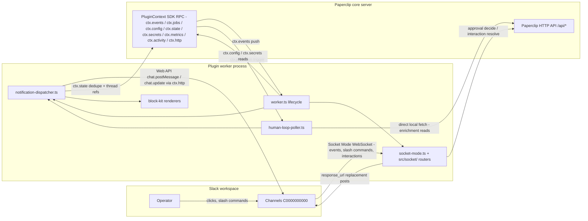
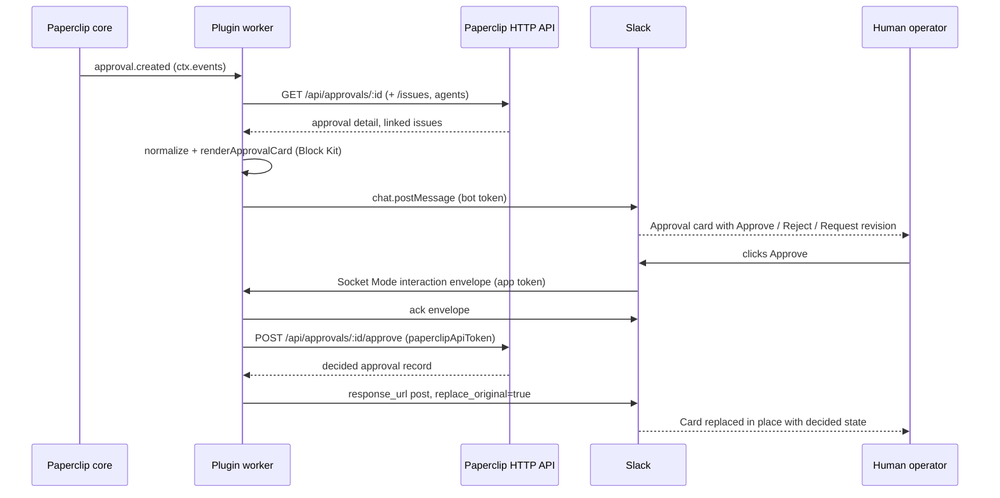

# Architecture

The Slack Notifications plugin turns Slack into an operator control surface for Paperclip companies. It runs as a single Paperclip plugin worker process that (a) subscribes to native Paperclip plugin events and renders them as deterministic Block Kit cards in Slack, (b) maintains a Slack Socket Mode WebSocket for ingress (slash commands, app events, and interactive button clicks), and (c) runs a scheduled reconciliation poller that scans the Paperclip HTTP API for human-in-the-loop (HITL) attention items that have no native plugin event. Paperclip remains the system of record; every interactive Slack action maps to an explicit Paperclip API call, and the Slack card is then updated in place to reflect the authoritative Paperclip state. No public URL, webhook endpoint, or Slack signing secret is required — all Slack ingress arrives over the outbound Socket Mode connection.

## Control planes

Three planes meet in the worker: Slack ingress (Socket Mode), Slack egress (Web API), and the Paperclip host surface (SDK RPC plus the poller's direct local-API fetch).

Key asymmetry: generic outbound HTTP (Slack Web API) goes through `ctx.http.fetch`, which the host sandboxes. Calls to the Paperclip API itself use process-local `fetch`, because the host's outbound HTTP client deliberately blocks loopback/private addresses and the Paperclip API is typically a local address.

## HITL approval flow

If the decide call fails (e.g. the approval was already resolved elsewhere), the worker re-fetches the current approval and replaces the card with its true state, or falls back to an ephemeral error message linking to Paperclip.

## Interface inventory

| Interface | Protocol | Direction | Auth | Breaks if changed |
|---|---|---|---|---|
| Slack Socket Mode | WebSocket (`@slack/socket-mode`) | Slack → worker | App-level token (`xapp-`, `connections:write`) | All ingress: slash commands, app events, button interactions stop arriving |
| Slack Web API (`chat.postMessage`, `chat.update`) | HTTPS via `ctx.http.fetch`, retry w/ backoff | Worker → Slack | Bot token (`xoxb-`) | No notifications can be posted or edited |
| Slack `response_url` posts | HTTPS via `ctx.http.fetch` | Worker → Slack | None (URL-scoped, short-lived) | In-place card replacement after interactions fails; Paperclip write still succeeds |
| `ctx.events` subscriptions | SDK RPC | Paperclip → worker | Plugin capability `events.subscribe` | Event-driven notifications (approvals, runs, issue updates) stop |
| `ctx.jobs` (`human-loop-poll`, `*/1 * * * *`) | SDK RPC | Paperclip → worker | Capability `jobs.schedule` | HITL reconciliation stops; interactions without native events go unnoticed |
| `ctx.config` / `onConfigChanged` / `onValidateConfig` | SDK RPC | Bidirectional | Host-managed | Token/channel routing config unavailable; Socket Mode cannot start |
| `ctx.secrets.resolve` | SDK RPC | Worker → Paperclip | Host-managed secret refs | Token refs (`slackBotTokenRef`/`slackAppTokenRef`) cannot resolve |
| `ctx.state` | SDK RPC | Worker → Paperclip | Capabilities `plugin.state.read/write` | Cross-restart dedupe and issue→thread routing degrade to in-memory |
| `ctx.metrics` / `ctx.activity` | SDK RPC | Worker → Paperclip | Capabilities `metrics.write`, `activity.log.write` | Observability only; no functional loss |
| Paperclip HTTP API reads (`/api/companies`, `.../issues`, `/api/approvals/:id`, `.../issues`, `/api/issues/:id/interactions`, `.../agents`) | HTTPS/HTTP, process-local `fetch` | Worker → Paperclip API | Optional Bearer `paperclipApiToken` | Poller and approval-card enrichment fail; fallback cards are sparse |
| Paperclip HTTP API writes (`POST /api/approvals/:id/{approve,reject,request-revision}`, interaction resolve endpoints) | HTTPS/HTTP, process-local `fetch` | Worker → Paperclip API | Optional Bearer `paperclipApiToken` | Slack buttons can no longer decide approvals/answer interactions |

## Module map

| Module | Responsibility |
|---|---|
| `src/worker.ts` | Plugin lifecycle: config load/validation, secret resolution, event subscriptions, job registration, Socket Mode start/stop, health |
| `src/manifest.ts` | Plugin manifest: capabilities, config schema, `human-loop-poll` job definition |
| `src/socket-mode.ts` | Socket Mode client lifecycle; envelope ack, classification, and routing shell |
| `src/socket/commands.ts` | `/paperclip` slash commands and app-mention handling |
| `src/socket/approval-actions.ts` | Approve/reject/request-revision buttons → Paperclip API → replacement card (incl. stale-approval recovery) |
| `src/socket/interaction-actions.ts` | Issue-thread HITL forms: submit, accept/reject, answer buttons |
| `src/socket/slack-state.ts`, `action-values.ts`, `replacements.ts`, `utils.ts`, `types.ts` | Slack `state.values` extraction, duplicate suppression, action-value JSON parsing, resolved-card copy, local types |
| `src/notification-dispatcher.ts` | Normalized event → dedupe (persistent/memory/best-effort) → destination → render → post; issue-thread tracking |
| `src/event-normalizers.ts` | Raw `PluginEvent` → `NormalizedNotification` |
| `src/notification-policy.ts` | Per-event-type enable flags and channel routing (default/approvals/errors/runs channels, issue threads) |
| `src/human-loop-poller.ts` | Scheduled scan of blocked-inbox attention; enrichment via Paperclip API; synthesizes idempotent events |
| `src/block-kit/` | Deterministic card renderers (`approval-cards`, `issue-cards`, `run-cards`), shared primitives, Slack size limits |
| `src/slack-api.ts` | Slack Web API wrapper: `postMessage`, `updateMessage`, `respondToInteraction`, retry/backoff |
| `src/state.ts`, `src/constants.ts`, `src/types.ts` | Plugin-state keys, action IDs/defaults, shared types |

## Design constraints (from ADRs)

- **Slack is a control surface, not the system of record (ADR-001).** Cards represent Paperclip state and safe actions; every button maps to an explicit Paperclip API command. The Paperclip web UI stays canonical for deep inspection — cards link back rather than duplicating everything.
- **Deterministic Block Kit rendering (ADR-002).** All Slack UI comes from versioned, typed, pure renderer functions over normalized events. No model-generated layouts. Stable namespaced `action_id`s, enforced Slack size limits (`block-kit/limits.ts`), snapshot/invariant tests required. Agent-authored text appears only in bounded content fields.
- **Notifications first, not notifications only (ADR-003).** The first slice is the notification/control loop, but seams are kept clean (normalizers, policy, renderers, Slack API, interaction handlers) so slash commands, thread linking, and richer company conversation flows can grow without rearchitecting.
- **Socket Mode only.** Ingress is exclusively the outbound Socket Mode WebSocket: no public URL, no Events API webhooks, no signing-secret verification surface. This keeps the plugin deployable behind NAT/firewalls with only two Slack tokens.
- **Event-first, poll-to-reconcile.** Native plugin events drive notifications wherever Paperclip emits one; the scheduled poller covers HITL surfaces (e.g. issue-thread interactions) that have no native event, using stable synthetic event IDs and best-effort persistent dedupe so restarts and missing state scope never double-post or drop the HITL loop.

## Development gotchas

Hard-won constraints that are easy to rediscover the painful way:

- **Slack packages must stay esbuild externals.** `@slack/socket-mode`, `@slack/web-api`, and `@slack/types` are CJS; bundling them into the ESM worker produces `Dynamic require of "node:os" is not supported` at plugin activation. `esbuild.config.mjs` lists them as externals and they are runtime `dependencies`, not devDependencies.
- **Slack platform limits**: section blocks cap at 3000 characters of text; messages cap at 50 blocks. `block-kit/limits.ts` enforces these — new renderers must go through it.
- **Slack retries Socket Mode envelopes.** Ack fast, dedupe before side effects; a slow handler means the same button click arrives twice.
- **Paperclip event payloads may omit previous values.** Diff detection can't assume a `previous` field exists.
- **Capabilities are granted at install, not upgrade.** Fresh installs get everything the manifest declares; adding a capability to an already-installed plugin requires approval and currently fails on local-path upgrades — so a new capability means uninstall + reinstall.
- **Approval buttons must never bypass Paperclip permissions/governance** — they call the same API endpoints a human would hit, with the same auth.
- **Events dispatched with no destination are marked seen permanently.** If `defaultChannelId` is empty, the dispatcher records each event as seen with reason `no-destination`; configuring the channel later does not resurrect those notifications. Configure the channel before enabling notify toggles.
