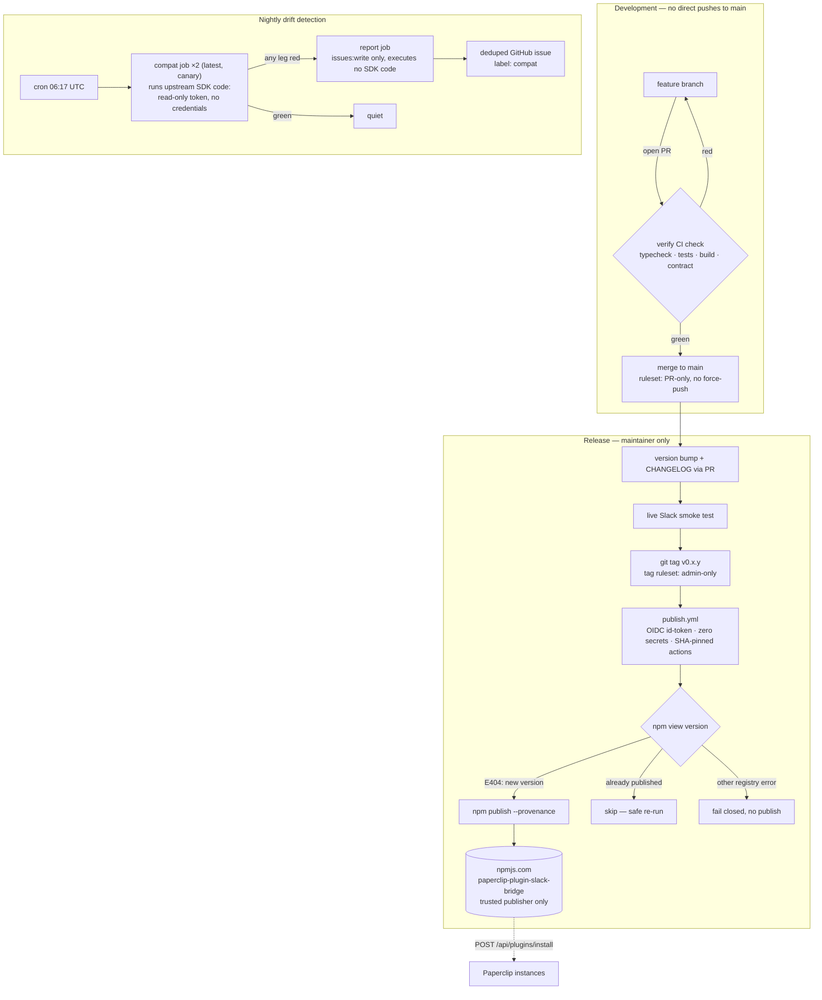

# Releasing

How a change travels from a branch to npm, and how you find out when
Paperclip core breaks the plugin.

There are no release branches — `main` is always releasable, and `main`
accepts no direct pushes: every change arrives via pull request with the
`verify` check green (0 approvals required, so a solo maintainer merges
their own PRs).

## Releasing a version

1. On a branch, set `package.json` to today's date version, e.g.
   `2026.702.0` (`src/constants.ts` derives `PLUGIN_VERSION` from it at build
   time) and add a `CHANGELOG.md` section.
2. Run `npm run verify` locally, then the live smoke test below.
3. Open a PR to `main`; merge when `verify` is green.
Versions are date-based, matching Paperclip core's convention:
stable = `YYYY.MDD.P` (UTC month+day, same-day patch slot), canary =
`YYYY.MDD.P-canary.N`. Every merge to `main` automatically publishes a canary
under the `canary` dist-tag — install with
`paperclip-plugin-slack-bridge@canary`. (Unlike core, canaries get no git
tags: the publish workflow deliberately cannot write to the repo.) Stable
releases are tag-driven:

4. Tag and push: `git tag v<version> && git push origin v<version>`.
   Only the repo admin can create `v*` tags. The tag triggers `publish.yml`,
   which publishes to npm via OIDC trusted publishing with provenance — it
   skips already-published versions and fails closed on registry errors.
5. Paste the changelog section into a GitHub release for the tag.

## Live smoke test

CI has no Slack and no real Paperclip host, so this ~10-minute manual pass
against a local Paperclip instance is the only end-to-end verification.

1. **Build + install** — `npm run verify`, install/upgrade the plugin in
   Paperclip, health reports `ok`.
2. **Socket Mode** — `/paperclip status` returns a status card.
3. **Notification path** — create an approval → card appears in the channel.
   Immediately after it appears, run `/paperclip status`, `companies`, and
   `issues <company>`; health must remain `ok` between event delivery and
   commands.
4. **Interaction path** — click **Approve** → card flips to the read-only
   decided state and the approval resolves in Paperclip.
5. **Poller path** — with an issue pending a user decision, wait one poll
   cycle (1 min) → human-input card appears.
6. **Config change** — toggle any notify setting → plugin stays healthy.

If a step fails after an SDK bump, [`COMPATIBILITY.md`](./COMPATIBILITY.md)
maps symptoms to contract surfaces.

## When the nightly goes red

The nightly re-runs the full verify gate against the SDK's `latest` and
`canary` npm dist-tags and files one deduplicated `compat` issue per broken
channel (the issue-filing job has `issues: write` and nothing else — it can
never modify code).

- **`canary` red, `latest` green** — incoming break. Reproduce with
  `npm install --no-save @paperclipai/plugin-sdk@canary @paperclipai/shared@canary && npm run verify`
  and fix before the next stable core release.
- **`latest` red** — new installs are broken now. Reproduce with `@latest`,
  fix, bump the patch version, release promptly.
- **Contract-script failure** — core changed the manifest or REST schemas;
  diff the new `pluginManifestV1Schema` / request schemas against
  `src/manifest.ts` and the payloads in `scripts/check-manifest-contract.mjs`.

## One-time setup: going public

Do these **in order** when creating the public repository, before the first
tag. After step 6 the only publish paths are a protected `v*` tag or a
`workflow_dispatch` from the maintainer's account — no npm tokens exist.

1. **Create the repo** — fresh history, default branch `main`, zero
   collaborators.
2. **Import rulesets** from `.github/rulesets/` (Settings → Rules → Rulesets →
   Import): `protect-main.json` (PR-only main, `verify` required, applies to
   the owner too) and `protect-release-tags.json` (admin-only `v*` tags).
3. **Actions settings** (Settings → Actions → General): workflow permissions =
   **Read repository contents**; fork PR workflows = **require approval for
   all external contributors**.
4. **First npm publish — manual.** Trusted publishing cannot be configured for
   a package that does not exist yet: from a clean clone, with npm 2FA,
   `npm publish --access public`. The only publish that ever uses local
   credentials.
5. **Register the trusted publisher** (npmjs.com → package → Settings):
   GitHub Actions, this repo, workflow `publish.yml`, allowed action
   **publish** only.
6. **Disallow token publishes** (package Settings → Publishing access).
7. **Verify the loop** — push the next patch tag and watch `publish.yml`
   publish via OIDC with provenance.
